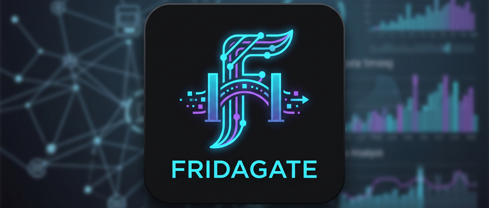

# 🔐 Fridagate

<div align="center">
  
  <p>Android pentesting toolkit - Frida server manager + Burp Suite proxy interceptor</p>

  
  
  
  
  
</div>

## 🔍 What is Fridagate?

Fridagate is an Android application that combines essential tools for mobile security research into a single, streamlined interface:

- **Frida Server Manager** - download, install, start, stop, and uninstall [frida-server](https://frida.re) directly from the device, with version selection and custom flag support.
- **Burp Suite Proxy Controller** - configure iptables transparent proxy rules and Android system proxy settings to route all device traffic through [Burp Suite](https://portswigger.net/burp) for interception.
- **Bypass Injection** *(experimental)* - on-device root detection and SSL pinning bypass using [frida-inject](https://frida.re), no PC required.

Instead of running multiple ADB commands manually before each pentest session, Fridagate lets you set up the entire interception stack in a single tap with the **ACTIVATE ALL** button.

## 📸 Screenshots

<div align="center">
  
  &nbsp;
  
  &nbsp;
  
  &nbsp;
  
</div>

<div align="center">
  <sub>Dashboard &nbsp;&nbsp;&nbsp;&nbsp;&nbsp;&nbsp;&nbsp;&nbsp;&nbsp; Frida Server &nbsp;&nbsp;&nbsp;&nbsp;&nbsp;&nbsp;&nbsp;&nbsp;&nbsp; Proxy &nbsp;&nbsp;&nbsp;&nbsp;&nbsp;&nbsp;&nbsp;&nbsp;&nbsp; Extras</sub>
</div>

## ✨ Features

### 🏠 Dashboard

- Global status overview (root, Frida, proxy, Burp reachability)
- **ACTIVATE ALL** - starts frida-server and enables iptables proxy in one tap
- **DEACTIVATE ALL** - cleanly tears down the entire setup
- Unified operation log

### 🪝 Frida Server

- Fetches available releases directly from the [GitHub API](https://api.github.com/repos/frida/frida/releases)
- Auto-detects device CPU architecture (`arm64`, `arm`, `x86_64`, `x86`)
- Downloads and decompresses `.xz` / `.zip` binaries
- Installs to `/data/local/tmp/frida-server` via root
- Start with default settings or custom flags (e.g., `-l 0.0.0.0:27042 --token=secret`)
- Version tracking across app restarts

### 🌐 Proxy

- **iptables transparent proxy** - redirects all TCP traffic on ports 80/443 to Burp Suite regardless of app proxy settings
- **System proxy** - sets Android's global HTTP proxy for apps that respect it
- One-tap connectivity test to verify Burp is reachable
- Burp CA certificate installer (required for HTTPS interception)
- Saves Burp IP and port settings across sessions

### 🧪 Extras *(experimental)*

- **Root Detection Bypass** - hooks `File.exists()`, `Runtime.exec()`, `SystemProperties`, and `PackageManager` to hide root indicators (su binaries, Magisk, SuperSU, build flags)
- **SSL Pinning Bypass** - bypasses certificate pinning for TrustManager, OkHttp, Conscrypt, HostnameVerifier, and Android Network Security Config
- App picker dropdown — lists all non-system installed apps
- Downloads `frida-inject` at the same version as `frida-server` (no PC required)
- Single **Launch** button spawns the target app with selected scripts injected from the first instruction
- > ⚠️ Some apps may not be compatible. Report issues at [github.com/JavierOlmedo/Fridagate/issues](https://github.com/JavierOlmedo/Fridagate/issues)

## 📋 Requirements

| Requirement | Details |
|---|---|
| Rooted Android device | Root is required for iptables, frida-server install, and cert installation |
| Android 7.0+ | Minimum SDK 24 |
| Burp Suite | Running on a PC connected to the same network as the device |
| Internet connection | To download Frida server binaries from GitHub |

## 🚀 Setup Guide

### 1. Configure Burp Suite

1. Open Burp Suite on your PC
2. Go to `Proxy → Options → Add` and create a listener on `0.0.0.0:8080`
3. Note your PC's local IP address (e.g., `192.168.100.224`)

### 2. Install Frida Server

1. Open Fridagate → **Frida** tab
2. Select the desired version from the dropdown (latest is pre-selected)
3. Tap **Install / Update Frida Server** and wait for the download and installation

> **Recommended version: 16.7.19**
> The latest Frida versions (17.x) may have spawn issues on some devices.
> Version **16.7.19** is the most stable for general use.
>
> To install it, scroll to the bottom of the version dropdown and tap **⚙ Custom version...**, then type `16.7.19`.
>
> Make sure your PC tools match the same version:
> ```bash
> pip install frida==16.7.19 frida-tools==12.5.0
> ```

### 3. Configure Proxy Settings

1. Go to the **Proxy** tab
2. Enter your PC's IP address (`192.168.100.224`) and Burp's port (`8080`)
3. Tap **Test** to verify connectivity

### 4. Activate Everything

1. Go to the **Dashboard** tab
2. Tap **ACTIVATE ALL**
3. Fridagate will start frida-server and enable the iptables proxy automatically

### 5. Install Burp's CA Certificate *(for HTTPS)*

1. Make sure the system proxy is enabled (Proxy tab)
2. Tap **Install Burp CA Certificate**
3. Reboot the device for all apps to recognize the certificate

## 🏗️ Architecture

Fridagate is built with modern Android development practices:

- **Jetpack Compose** - declarative UI
- **MVVM** - ViewModels hold state, screens observe and react
- **Kotlin Coroutines** - all network and root operations run on background threads
- **StateFlow** - reactive state management between ViewModel and UI
- **DataStore** - persistent storage for user settings
- **OkHttp** - HTTP client for GitHub API and binary downloads
- **Navigation Compose** - single-Activity navigation with bottom tabs

## ⚙️ How the Proxy Works

```text
Android App
    │
    ▼  (port 80 / 443)
iptables NAT (DNAT rule)
    │
    ▼  redirected transparently
Burp Suite Proxy (192.168.100.224:8080)
    │
    ▼  decrypts with its CA cert
Internet
```

The iptables DNAT rules intercept outgoing TCP packets destined for ports 80 and 443 and rewrite their destination to Burp Suite's IP and port - without the app knowing. This works even for apps that explicitly disable proxy support.

## ⚠️ Disclaimer

> Fridagate is intended for **authorized security testing only**.
> Only use this tool on devices and applications you own or have explicit written permission to test.
> Unauthorized interception of network traffic may be illegal in your jurisdiction.
> The author assumes no responsibility for misuse of this software.

## 🔗 Links

- [GitHub Repository](https://github.com/JavierOlmedo/Fridagate)
- [Report an Issue](https://github.com/JavierOlmedo/Fridagate/issues)
- [Author - Javier Olmedo](https://hackpuntes.com)

## 📄 License

This project is licensed under the MIT License - see the [LICENSE](LICENSE) file for details.

<div align="center">
  <sub>Built for security researchers, by a security researcher.</sub>
  
  <sub>Made with ❤️ in Spain</sub>
</div>
