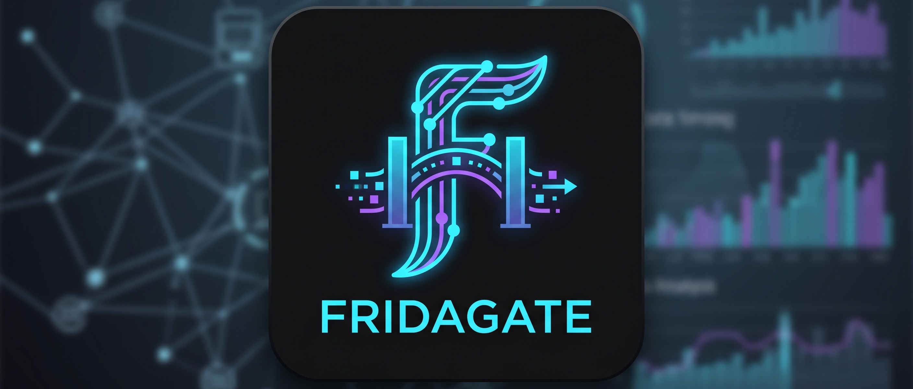

# 🔐 Fridagate

<div align="center">
  
  <p>Android pentesting toolkit - Frida server manager + proxy interceptor for Burp Suite, Caido and mitmproxy</p>

  
  
  
  
  
  
</div>

## 🔍 What is Fridagate?

Fridagate is an Android application that combines essential tools for mobile security research into a single, streamlined interface:

- **Frida Server Manager** - download, install, start, stop, and uninstall [frida-server](https://frida.re) directly from the device, with version selection, custom flags, and a custom binary name and port.
- **Proxy Controller** - route the traffic of the whole device, or of a single app, through [Burp Suite](https://portswigger.net/burp), [Caido](https://caido.io) or [mitmproxy](https://mitmproxy.org) with iptables transparent proxy rules or Android's system proxy, and install the proxy's CA as a system CA.
- **Bypass Injection** *(experimental)* - on-device root detection and SSL pinning bypass using [frida-inject](https://frida.re), plus your own scripts, no PC required.
- **Diagnostics** - one report with everything that decides whether the setup works on a device, ready to paste in an issue.

Instead of running multiple ADB commands manually before each pentest session, Fridagate lets you set up the entire interception stack in a single tap with the **ACTIVATE ALL** button.

## 📸 Screenshots

<div align="center">
  
  &nbsp;
  
  &nbsp;
  
  &nbsp;
  
</div>

<div align="center">
  <sub>Dashboard &nbsp;&nbsp;&nbsp;&nbsp;&nbsp;&nbsp;&nbsp;&nbsp;&nbsp; Frida Server &nbsp;&nbsp;&nbsp;&nbsp;&nbsp;&nbsp;&nbsp;&nbsp;&nbsp; Proxy &nbsp;&nbsp;&nbsp;&nbsp;&nbsp;&nbsp;&nbsp;&nbsp;&nbsp; Extras</sub>
</div>

## ✨ Features

### 🏠 Dashboard

- Global status overview (root, Frida, iptables and system proxy, proxy reachability)
- **ACTIVATE ALL** - starts frida-server and enables the iptables proxy in one tap, only for the target app when one is picked in the Proxy tab. With mitmproxy it sets the system proxy instead
- **DEACTIVATE ALL** - cleanly tears down the entire setup
- Unified operation log

### 🪝 Frida Server

- Fetches available releases directly from the [GitHub API](https://api.github.com/repos/frida/frida/releases)
- Auto-detects device CPU architecture (`arm64`, `arm`, `x86_64`, `x86`)
- Downloads and decompresses `.xz` / `.zip` binaries
- Installs to `/data/local/tmp` via root
- Start with default settings or custom flags (e.g., `-l 0.0.0.0:27042 --token=secret`)
- **Stealth** - pick the binary name (or generate a random one) and the listen port, so apps that look for a `frida-server` process or probe port 27042 don't find it. With a custom port, `frida -U` no longer reaches the server: run `adb forward tcp:27042 tcp:<port>` and connect with `frida -H 127.0.0.1:27042`
- Version tracking across app restarts

### 🌐 Proxy

- Works with **Burp Suite**, **Caido** and **mitmproxy**: pick your tool and Fridagate downloads the right CA and tells you what the tool needs
- **iptables transparent proxy** - redirects TCP traffic on ports 80/443 to the proxy regardless of app proxy settings
  - **Target app** - redirect only one app's traffic and keep the rest of the device out of your proxy history, or pick **All apps**
  - Uses its own chains (`FRIDAGATE_*`): rules from VPNs, tethering or firewall apps are never flushed
  - Blocks QUIC (UDP 443) and IPv6 web traffic so apps fall back to TCP over IPv4, which is what gets redirected
  - Fridagate's own traffic (GitHub downloads) is excluded
- **System proxy** - sets Android's global HTTP proxy for apps that respect it
- One-tap connectivity test to verify the proxy is reachable
- CA certificate installer (required for HTTPS interception)
  - Works on Android 7 to 14+, including the Conscrypt APEX store introduced in Android 14
  - No `/system` remount, no `curl` or `openssl` needed on the device
  - Shows whether the CA the proxy is serving right now is trusted by the system
  - **Install again at boot** - optionally puts the CA back after every reboot, with no proxy needed
- Saves the tool, IP, ports and target app across sessions

### 🧪 Extras *(experimental)*

- **Root Detection Bypass** - hooks `File.exists()`, `Runtime.exec()`, `SystemProperties`, and `PackageManager` to hide root indicators (su binaries, Magisk, SuperSU, build flags)
- **SSL Pinning Bypass** - bypasses certificate pinning for TrustManager, OkHttp, Conscrypt, HostnameVerifier, and Android Network Security Config
- **Your own scripts** - **Import .js** copies any Frida script into the app. It shows up next to the built-in ones and is injected the same way
- App picker dropdown — lists all non-system installed apps
- Downloads `frida-inject` at the same version as `frida-server` (no PC required)
- Single **Launch** button spawns the target app with selected scripts injected from the first instruction
- > ⚠️ Some apps may not be compatible. Report issues at [github.com/JavierOlmedo/Fridagate/issues](https://github.com/JavierOlmedo/Fridagate/issues)

### 🩺 Diagnostics

- In the **About** tab, **Run** checks the root manager, the su mount namespace, `nsenter`, SELinux, iptables, frida-server and frida-inject, proxy reachability, the iptables redirect, the system proxy, the CA trust store and whether the installed CA is trusted right now
- **Copy report** copies it as plain text. It leaves out the proxy address and the target app, so you can paste it in a public issue

## 📋 Requirements

| Requirement | Details |
|---|---|
| Rooted Android device | Root is required for iptables, frida-server install, and cert installation |
| Android 7.0+ | Minimum SDK 24 |
| Intercepting proxy | Burp Suite, Caido or mitmproxy, running on a PC in the same network as the device |
| Internet connection | To download Frida server binaries from GitHub |

## 🚀 Setup Guide

### 1. Configure your proxy

The iptables mode redirects traffic without the app knowing, so apps send their requests straight to the proxy, without a `CONNECT`. The proxy has to accept them as a transparent (invisible) proxy.

**Burp Suite**

1. Go to `Proxy → Proxy settings → Proxy listeners` and add a listener on `0.0.0.0:8080` (all interfaces)
2. Edit the listener and, in `Request handling`, enable **Support invisible proxying**

**Caido**

1. Listen on all interfaces: change the instance's listening address to `0.0.0.0:8080`, or start the CLI with `caido -l 0.0.0.0:8080`
2. Keep invisible proxying on. It is on by default for local instances of the desktop app; the CLI needs `--invisible`

**mitmproxy**

1. Start `mitmproxy` or `mitmweb`. By default they listen on port 8080 on every interface
2. Use Fridagate's **System Proxy**, not the iptables mode: mitmproxy's transparent mode needs traffic that hasn't been NATed on its way. For apps that ignore the system proxy, use mitmproxy's [WireGuard mode](https://docs.mitmproxy.org/stable/concepts/modes/#wireguard) instead

Then note your PC's local IP address (e.g., `192.168.100.224`).

### 2. Install Frida Server

1. Open Fridagate → **Frida** tab
2. Select the desired version from the dropdown (latest is pre-selected)
3. Tap **Install / Update Frida Server** and wait for the download and installation

> **Recommended version: 16.7.19**
> The latest Frida versions (17.x) may have spawn issues on some devices.
> Version **16.7.19** is the most stable for general use.
>
> To install it, scroll to the bottom of the version dropdown and tap **⚙ Custom version...**, then type `16.7.19`.
>
> Make sure your PC tools match the same version:
> ```bash
> pip install frida==16.7.19 frida-tools==12.5.0
> ```

### 3. Configure Proxy Settings

1. Go to the **Proxy** tab
2. Pick your tool: Burp Suite, Caido or mitmproxy
3. Enter your PC's IP address (`192.168.100.224`) and the proxy's port (`8080`)
4. Tap **Test** to verify connectivity
5. *(Optional)* In **Target app**, pick the app you are testing to redirect only its traffic. **All apps** redirects the whole device

### 4. Activate Everything

1. Go to the **Dashboard** tab
2. Tap **ACTIVATE ALL**
3. Fridagate will start frida-server and enable the iptables proxy automatically (the system proxy with mitmproxy)

### 5. Install the Proxy's CA Certificate *(for HTTPS)*

1. Make sure the proxy is reachable (Proxy tab → **Test**)
2. Tap **Install Burp Suite CA Certificate** (or the Caido / mitmproxy one)
3. Restart (force-stop) the target apps so they load the new trust store
4. *(Optional)* Turn on **Install again at boot**

> The CA is added with an in-memory overlay of the system store, so a reboot removes it. With **Install again at boot** on, Fridagate puts it back when the device starts, from the copy it keeps in `/data/local/tmp/fridagate/`, no proxy needed. Otherwise, install it again after every reboot. The Proxy tab shows whether the CA is currently trusted.
>
> The boot install runs after the first unlock and needs root granted to Fridagate for good. Some ROMs (MIUI / HyperOS, ColorOS…) also need Fridagate to be allowed to autostart.

## 🏗️ Architecture

Fridagate is built with modern Android development practices:

- **Jetpack Compose** - declarative UI
- **MVVM** - ViewModels hold state, screens observe and react
- **Kotlin Coroutines** - all network and root operations run on background threads
- **StateFlow** - reactive state management between ViewModel and UI
- **DataStore** - persistent storage for user settings
- **OkHttp** - HTTP client for GitHub API and binary downloads
- **Navigation Compose** - single-Activity navigation with bottom tabs

## ⚙️ How the Proxy Works

```text
Android App
    │
    ▼  (TCP 80 / 443)
iptables nat OUTPUT → FRIDAGATE_OUT (DNAT)
    │
    ▼  redirected transparently
Burp Suite / Caido (192.168.100.224:8080, invisible proxying)
    │
    ▼  decrypts with its CA cert
Internet
```

The DNAT rules in the `FRIDAGATE_OUT` chain rewrite the destination of outgoing TCP connections to ports 80 and 443 to the proxy's IP and port, without the app knowing. This works even for apps that explicitly disable proxy support.

With a **target app**, every rule carries an owner match (`-m owner --uid-owner <uid>`). Each Android app runs under its own Linux uid, so only that app's connections are redirected (and only its QUIC and IPv6 traffic blocked), while the rest of the device keeps a direct connection.

Traffic that a TCP redirect can't catch is blocked so that apps fall back to a path that is redirected:

- **QUIC / HTTP3** (UDP 443) is rejected, so apps retry over TCP.
- **IPv6** web traffic is rejected, so apps retry over IPv4. An IPv4 proxy can't be the DNAT target of an IPv6 connection.

Disabling the proxy only removes Fridagate's own chains and jump rules, plus the rules left by Fridagate 1.0.x.

## 🔑 How the CA Install Works

1. The proxy's CA is downloaded inside the app: Burp serves it at `http://<ip>:<port>/cert`, Caido at `http://<ip>:<port>/ca.crt`, and mitmproxy at `http://mitm.it/cert/pem`, through the proxy itself. Its Android file name (`subject_hash_old`, e.g. `9a5ba575.0`) is computed in Kotlin, and the certificate is kept in `/data/local/tmp/fridagate/`.
2. A tmpfs is mounted over `/system/etc/security/cacerts`, holding the currently trusted CAs plus the proxy's. This runs in the global mount namespace (`su --mount-master`, or `nsenter` into init) so every app sees it.
3. On Android 14+, CAs are read from the Conscrypt APEX (`/apex/com.android.conscrypt/cacerts`), which is mounted per process. The overlay is bind-mounted over it inside zygote, which covers every app launched afterwards, and inside every running app.
4. The file is read back the way apps see it and compared with the proxy's CA.
5. With **Install again at boot**, a `BOOT_COMPLETED` receiver repeats steps 2 to 4 with the kept certificate.

## 🛠️ Development

### Versioning

The version is defined in one place: `appVersion` in `gradle.properties`. `versionName` is that value, and `versionCode` is computed from it (`MAJOR * 10000 + MINOR * 100 + PATCH`, so `1.1.0` is `10100`).

Don't edit it by hand: run `bumpPatch`, `bumpMinor` or `bumpMajor` from Android Studio's Gradle panel (**Tasks → versioning**), or from a terminal:

```bash
./gradlew bumpPatch    # 1.0.3 -> 1.0.4 (gradlew bumpPatch on Windows)
```

### Continuous integration

Every push to `main` and every pull request builds the debug and release APKs, runs the unit tests and runs lint ([ci.yml](.github/workflows/ci.yml)). The iptables tests run against the real iptables, in a throwaway network namespace.

### Releasing

1. Bump the version, commit and push
2. Publish a GitHub release whose tag is `v` plus `appVersion` (e.g. `v1.1.0`)
3. The [release workflow](.github/workflows/release.yml) checks that the tag matches `appVersion`, builds the signed APK and attaches it to the release as `fridagate.apk`

The workflow signs with the release keystore, stored as two repository secrets (see [keystore/README.md](keystore/README.md)). Without them it only warns, and the APK built with **Generate Signed App Bundle / APK** has to be attached by hand.

## ⚠️ Disclaimer

> Fridagate is intended for **authorized security testing only**.
> Only use this tool on devices and applications you own or have explicit written permission to test.
> Unauthorized interception of network traffic may be illegal in your jurisdiction.
> The author assumes no responsibility for misuse of this software.

## 🔗 Links

- [GitHub Repository](https://github.com/JavierOlmedo/Fridagate)
- [Report an Issue](https://github.com/JavierOlmedo/Fridagate/issues)
- [Author - Javier Olmedo](https://hackpuntes.com)

## 📄 License

This project is licensed under the MIT License - see the [LICENSE](LICENSE) file for details.

<div align="center">
  <sub>Built for security researchers, by a security researcher.</sub>
  
  <sub>Made with ❤️ in Spain</sub>
</div>
